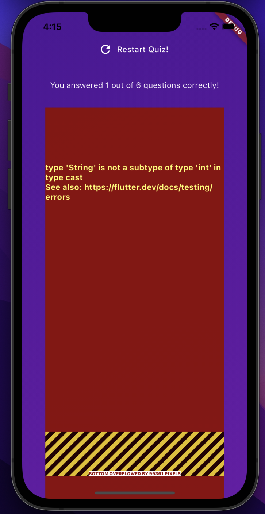
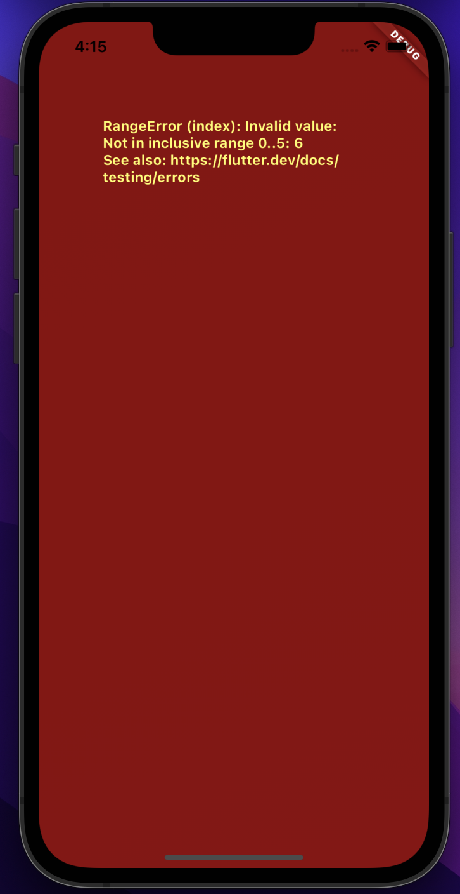
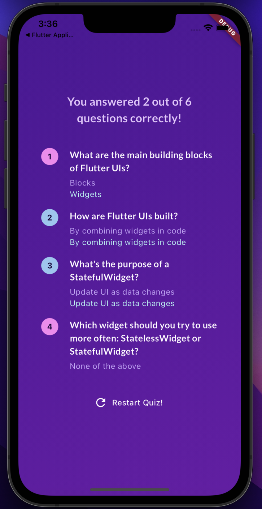

# Lab 02 Quiz app - example

During this lab session, you will address **two bugs** in the quiz application discussed in class. The lab project (courses > software-studio > 2024-spring > lab-flutter-basics-dart-quiz-app) provides the quiz application with pre-existing bugs.

The first part is to **resolve the error** that occurred during the **initial round**, described as follows:

 ( 20% )  
   

During the **subsequent round** of troubleshooting, an error, illustrated in the figure below, is expected to manifest:

 ( 20% )  
   

 ( 60% )  

The second part is to **enhance the appearance of the ResultsScreen**. A comparison between the **original screen** and the **desired outcome** is provided:

   
   

Adjustments include 

 ( 20% ) modifying the **font size** of the title (including the number of correct answers and the question title).   

 ( 20% ) Additionally, display a **circular background** behind the question index. **Different colors**(Correct -> Color.fromARGB(255, 150, 198, 241), Wrong -> Color.fromARGB(255, 249, 133, 241)) will be used to indicate correctness or errors.  

 ( 20% ) The **user's selected option** should be represented in a **translucent purple color** (Color.fromARGB(255, 202, 171, 252)), while the correct solution should be highlighted by a **translucent green color** (Color.fromARGB(255, 181, 254, 246)).
  

## Deadline
Submit your work before 2024/03/07 (Thur.) 17:20:00.

The score you have done will be 100%.

Submit your work before 2024/03/07 (Thur.) 23:59:59.

The score of other part you have done after 17:20:00 will be 60%.

# Resources

A few introductory tutorials crafted to assist you in completing today's lab.

- [List](https://api.flutter.dev/flutter/dart-core/List-class.html)
- [TextStyle](https://api.flutter.dev/flutter/painting/TextStyle-class.html) and [GoogleFonts](https://pub.dev/packages/google_fonts)
- [BoxDecoration](https://api.flutter.dev/flutter/painting/BoxDecoration-class.html)